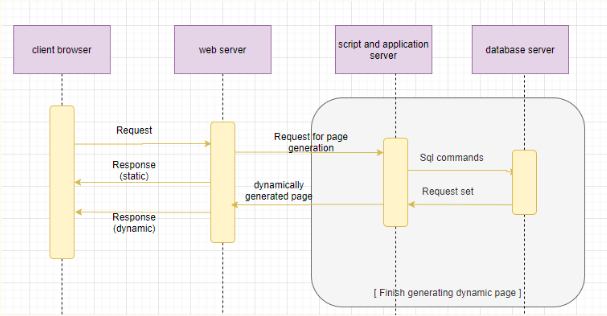

# PROJECT: BANKING SOLUTIONS- Cipher One*
 
### About the project:

This is a website that helps the financial industry in protecting customers and be always ahead of the hackers in building more secure solutions ranging from secure mobile solutions to more optimized and secure encryption algorithms. Apart from that we have introduced a fun way to aware our customers by videos and awareness gallery.

### Solution
    
    TO MAKE THE SYSTEM SECURE AND CUSTOMERS AWARE:-
 - password is kept encrypted with a security key, ip address and device is tracked during the session to make sure its the same user who logs in next time.
 - Database is also encrypted to make sure that the information is safe.
 - P.D.O. and prepare statements are used to prevent sql injections.
 - Firewalls should be used to prevent the breach which is caused by making the system loaded.
 - Tunnel security is also an essential factor to make sure the site is secure.
 - M.V.C. is a good measure to be used  as a framework, since it keeps data secure.
 - making small animated videos and putting them in a discrete manner that it does not interfere much with the customer’s workflow and is also able to make them aware about their safety and security measures.
 

## 📋 Table of Contents
 ➡️   [Vision](#-vision)
 
 ➡️   [Tech Stack](#-tech-stack)

 ➡️   [Tech Architecture](#-tech-architecture)
 
 ➡️   [Learning Resources](#-learning-resources)
 
 ➡️   [Uniqueness](#-Uniqueness)
 
 ➡️   [Owner](#-owner)
 
 ## 👩‍ Vision
To make a fun and interacting website to create awareness about CYBER SECURITY and providing help to financial industry.

## 🔆 Tech Stack
-  HTML
-  CSS
-  JavaScript
-  GitHub

[The database is made in MySql and the backend linking is done with the help of Php. The front end is made in HTML and CSS. 
The front end has login and sign-up page, the data is simultaneously saved in the database and compared to check if there is no breach.
For the purpose of awareness, there are small text and videos which make the information easy to understand and intersenting.]

## 🚀 Tech Architecture
 - The framework is M.V.C.and the device recogisatin is done by adding details of user in his every session and during login, They are matched to check if it is ame device or not.     ip address, device, cookies are tracked.
 - All the data is retrieved by Php, and the data in the database is encrypted by standard AES algo. P.D.O. connection and prepare statements are used to prevent sql injections.
 - Virtual keyboard is also used to stop keyloggers since keystrokes can be tracked and can be used to breach account.
 
 

 
## 📝 Learning Resources

Read these articles to get a quick grab on github pages:
- [GitHub Pages](https://guides.github.com/features/pages/)

Resources to learn Git:
-  https://try.github.io/
 
 ## 💼 Uniqueness
 - Device Recognition- By tracking IP address, Cookies, Browser and O.S.
 - Virtual keyboard- In order to prevent track of keystrokes
 - Animated Videos- For the purpose of awareness

 
 ## 👬 Owner

<a href="https://github.com/oshinsaini"><b>Oshin Saini</b></a> 

## 🧐 View Project
⭐ [Check out the website of cipher-one](https://cipher-one.github.io/)
 
 
 *-ongoing project
